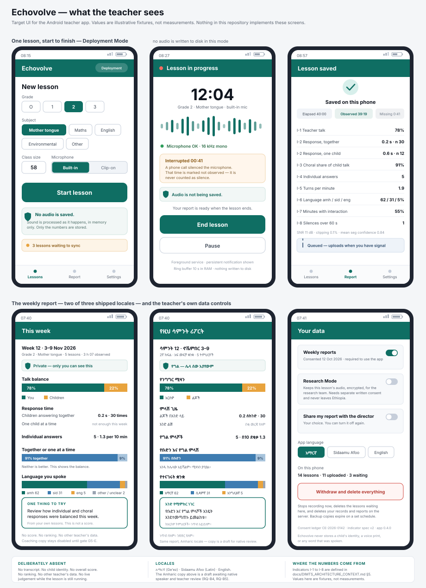
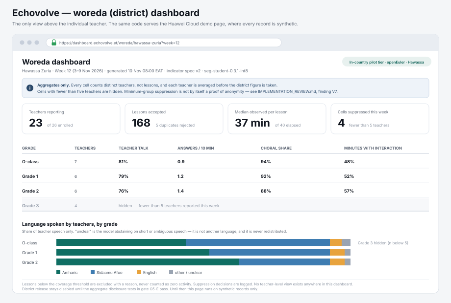
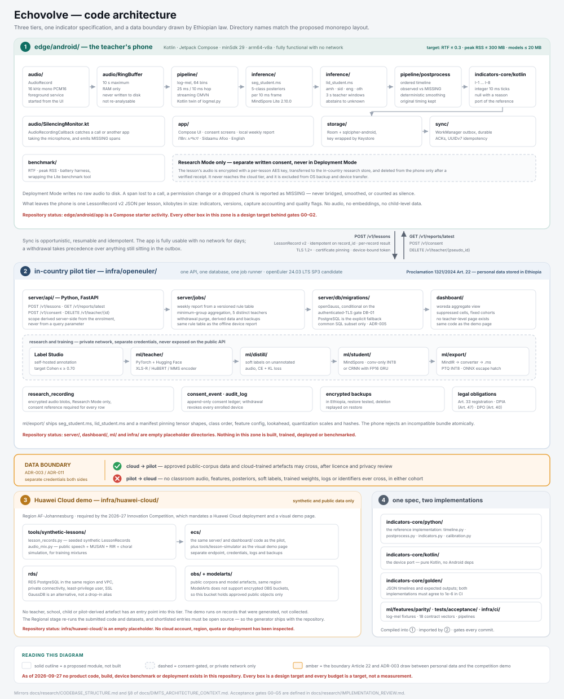

# Echovolve (ድምጽ)

> **Infrastructure update — 2026-10-02:** The [current repository structure](docs/research/CODEBASE_STRUCTURE.md), [ADR-015](docs/adr/015-capability-gated-hosting.md), [security architecture](docs/security/ARCHITECTURE.md) and [deployment scaffolding](infra/README.md) supersede the earlier infrastructure illustration and OS/database choices below. Zergaw shared hosting is conditional on provider evidence; FastAPI/ASGI or Django/WSGI and the database remain unselected. The later feature review removes persisted-audio Research Mode; ADR-015’s conditional hosting/security work is preserved. This repository pass adds contracts/scaffolding and checker tests, not product features.

> **Feature scope — 2026-10-03:** [FEATURE_REVIEW](docs/research/FEATURE_REVIEW.md) and draft [ADR-016](docs/adr/016-defence-scope-and-no-recording.md) set the June 2027 planning baseline: Grade 2 reading, offline reflection, conditional I-1/I-5, no persisted research audio. Other indicators and live official reporting are explicitly deferred. No product code was implemented by this review.

> **Stakeholders and research output — 2026-10-03:** the [participation map](docs/research/STAKEHOLDER_MAP.md), [research data/access plan](docs/research/RESEARCH_DATA_MANAGEMENT_PLAN.md) and draft [ADR-017](docs/adr/017-research-data-access-and-publication.md) add a thesis/manuscript deliverable and Anteneh's named, approved research access in Ethiopia. Coded study records remain restricted; anonymous publication outputs need separate disclosure review. No stakeholder appointment, institutional permission or account has been granted by these plans.


**Echovolve turns a cheap Android phone into a private coach for early-grade teachers in Ethiopia.**
The planned phone app processes a lesson in a RAM buffer, saves only an encrypted summary, and offers a
short weekly reflection in Amharic, Sidaamu Afoo or English. The teacher chooses one practice to try.
An adult/child talk measure and turn density appear only if their separate validity gates pass; the
original eight-indicator ambition is retained below with explicit deferrals.

There is no speech recognition anywhere in the system. Nothing is transcribed, no child is identified,
no voice print is stored, and no teacher is scored, ranked or compared. The design principle is
**coaching, not surveillance**, and it is enforced by the architecture rather than by policy alone.

> [!IMPORTANT]
> **This repository is at the design stage.** As of this review, product code is a Jetpack
> Compose starter activity under `edge/android/app`; prepared acceptance/hosting checkers also exist. There is no capture, no inference, no indicator
> engine, no server, no dashboard and no deployment. Every screen and every box in this README is a
> design target behind the acceptance gates in
> [`docs/research/IMPLEMENTATION_REVIEW.md`](docs/research/IMPLEMENTATION_REVIEW.md). All numbers shown
> in the mockups are illustrative fixtures, not measurements.

Echovolve is a B.Sc. final-year project at Hawassa University (defence June 2027) and an entry in the
Huawei ICT Competition 2026–2027, Innovation track. The documents under `docs/` still carry the earlier
codename **Dimts**; they have not been renamed.

---

## Contents

1. [The problem](#1-the-problem)
2. [What Echovolve does](#2-what-echovolve-does)
3. [What the teacher sees](#3-what-the-teacher-sees)
4. [The eight indicators](#4-the-eight-indicators)
5. [Architecture](#5-architecture)
6. [Huawei technology](#6-huawei-technology)
7. [Privacy, ethics and Ethiopian law](#7-privacy-ethics-and-ethiopian-law)
8. [Status: what exists and what does not](#8-status-what-exists-and-what-does-not)
9. [Definition of done](#9-definition-of-done)
10. [Roadmap](#10-roadmap)
11. [Documentation](#11-documentation)
12. [Evidence and citations](#12-evidence-and-citations)

---

## 1. The problem

**Ethiopia has measured its children repeatedly, and the line is flat.** Across three national rounds of
the Early Grade Reading Assessment, the share of Grade 2–3 pupils reaching the top two reading benchmark
levels was 31.3% in 2014, 34.3% in 2016 and 32.4% in 2018 — differences the report itself calls too small
to be practically significant (AIR, 2019, p. ix). Only 6.2% read fluently with full comprehension, and the
spread between languages is enormous: 50.0% of Amharic pupils reach the top two levels against 16.0% in
Haddiysa. A fourth child-assessment instrument is not the missing piece.

**Teacher capability is a real and addressable constraint — but it is not the only one.** The Mother
Tongue Teachers' Competencies Assessment found 39% of mother-tongue teachers at Proficient or above, with
Sidaamu Afoo teachers in the 22–33% band; its own multivariate ranking puts home resources first, school
resources second and teacher competency third (AIR, 2020). A separate study of 30 early-grade English
teachers in five schools recorded a mean of 43.4% on a reading-instruction knowledge test, with 70% below
50% (Yisihak & Damtew, 2024) — a case study, not a national estimate.

**Observation and reading outcomes are associated.** Where a school has someone who observes
mother-tongue classes, pupils read better (d = 0.23–0.28), and observing three times a semester rather
than never is associated with d = 0.18 (AIR, 2019, pp. 53–54). The honest framing is not that teachers get
no feedback; it is that observation is **uneven, infrequent and unstandardised**, with local access and observer capacity still to be established. That is the gap Echovolve aims at: frequent, private,
non-evaluative reflection; operating cost and educational benefit remain to be measured.

**Mother-tongue implementation is uneven.** Heugh et al. (2007) documents language-proficiency and
implementation problems, using about a hundred classroom observations. That does not prove nobody
measures classroom language. Current policy and regional practice still need verification; automated
language-policy monitoring is deferred ([feature review](docs/research/FEATURE_REVIEW.md#22-ethiopia-fit-the-system-teachers-already-inhabit)).

**Pre-primary grew faster than its quality.** Pre-primary gross enrolment reached 59.8% in 2024/25 — a
national figure that excludes Amhara — against 145.9% in Addis Ababa and 17.7% in Somali (MoE, 2025). In
2021/22 about 75% of pre-primary children were in O-classes and child-to-child programmes rather than
kindergartens (MoE figures cited in Alemu, 2025). Class sizes in Grades 1–6 average 54.2 nationally and 59.6 in Sidama (MoE, 2025).

---

## 2. What Echovolve does

A teacher opens the app, optionally runs a **30-second capture-readiness check**, and taps **Start
lesson**. Audio lives in a RAM ring buffer for at most ten seconds, including during the check; it is
never written to disk. Capture can be paused (the buffer clears and the gap is marked not observed),
resumed, then ended with **Save summary** or **Discard** before anything is queued.

One coarse on-device model is the first candidate: adult / child-unspecified / overlap / non-speech.
Adult voice is a teacher proxy only in confirmed single-adult lessons without played speech. This needs
a new label/spec version; it is not the old five-class model with renamed logits. VAD alone cannot show
teacher talk. I-1 and, separately, I-5 appear only after their field gates; all other indicators are deferred.

At the end, optional context chips identify demonstration/mixed/pupil practice/unsure and adult/playback
conditions. Teachers can exclude a lesson from their local reflection. The weekly page works offline,
shows at most two eligible measures and **one teacher-selected practice card** from three reviewed
choices. One optional Tried / Not yet / Not useful / Skip follow-up appears at the next weekly opening.
Values never choose a weakness or a target ratio. The exact eligibility rule is in
[review A1](docs/research/FEATURE_REVIEW.md#a1--one-practice-one-action-one-response).

Opt-in derived-data sync to an Ethiopian server is a later, security-gated slice. Local-only field use
also needs a written Article 22 interpretation. Real director/browser accounts and district releases
are **deferred post-defence**; the competition page uses synthetic aggregates. No report waits for a network.

**What Echovolve deliberately does not do**

| Not this | Why |
|---|---|
| Speech recognition or any speech-derived text | Scope, compute and data minimisation. Every indicator is acoustic, so no words are ever reconstructed. |
| Identify individual children, by voice or otherwise | `CHILD_SINGLE` and `CHILD_CHORAL` are acoustic classes, not people. No speaker embeddings are persisted anywhere. |
| Score, rank or evaluate teachers | The report belongs to the teacher. Optional on-screen discussion belongs to the teacher; sharing accounts are deferred. |
| Assess children's reading | Forced-alignment child diagnostics are removed from this product roadmap. |

---

## 3. What the teacher sees

**Historical mockups, not the revised delivery contract.** Six original screens illustrate: starting a lesson, the lesson itself, the saved result, the weekly
report in two of its three locales, and the teacher's own controls over consent and deletion.



### 3.1 Why the UI looks like this

Almost every visible choice traces back to a constraint or a finding, not to taste.

| What you see | Why it is that way |
|---|---|
| **"No audio is saved"** on the start screen, repeated in the lesson | It is the literal truth of the architecture, and it is the first thing a teacher who fears surveillance needs to know. Nearly all teachers weigh their own privacy when technology enters the classroom (Birnhack & Perry-Hazan, 2021). |
| **No live score during the lesson** — only a timer, a level meter and a microphone-health light | Coaching is weekly and reflective. A live number turns the phone into an invigilator, which is exactly the failure mode the project is trying to avoid. |
| **An interruption is shown, in seconds, as "not observed"** | A phone call silences the microphone and the app receives silence, not an error. Time lost this way is reported as `MISSING` and is never bridged, smoothed or counted as classroom silence — otherwise the indicators would quietly invent an unusually quiet lesson. |
| **Elapsed, observed and missing time are three separate numbers** | Every rate uses observed time as its denominator. A record with poor coverage is flagged, not silently averaged in. |
| **"One child at a time — not enough this week"** instead of a zero | An unavailable indicator returns null with a reason. Showing 0 would read as a successful measurement of no activity. |
| **Deferred: choral vs individual shown as a balance** | The evidence genuinely points both ways: choral responding is an established active-response technique (Heward et al., 1989) and a marker of rote teaching (Pontefract & Hardman, 2005; Hardman et al., 2009). The UI must not pick a side the evidence has not picked. |
| **Exactly one suggestion per week** | Feedback that changes practice is specific and sparse (Hattie & Timperley, 2007; Kraft et al., 2018). A bundled automated-feedback trial estimated a 3.5-percentage-point reduction (about 4.8% relative) in mentors’ talk share; it does not isolate this app’s metric or establish Ethiopian learning gains (Demszky & Liu, 2023, Table 2). |
| **"From your own lessons. This is not a score."** | The teacher selects the practice; a versioned eligibility rule controls the adjacent observation panel, never teacher evaluation. |
| **Amharic, Sidaamu Afoo and English, with Ge'ez and Latin side by side** | Teachers need locally comprehensible copy; interface localisation does not depend on the deferred language-ID model. |
| **"Withdraw and delete everything" as a first-class button** | Withdrawal stops capture immediately and discards queued lessons. Remote deletion remains pending until acknowledged; backups require deletion replay. It takes precedence over anything already in the outbox. |

> The Amharic copy in the mockup is a working draft. Report wording is to be co-designed with pilot
> teachers and reviewed by native speakers before it ships (research questions B4 and B5).

### 3.2 The district dashboard

**Deferred for real officials until post-defence.** The competition visual page uses synthetic records
and demonstrates suppression; this historical mockup’s language charts are not a production LID promise.



Aggregation counts **distinct teachers, not lessons**, averages each teacher before taking the district
figure, and hides any cell with fewer than five teachers (Sweeney, 2002). Fixed cohorts and fixed windows
remove the drill-down that would otherwise allow differencing attacks. This is called *minimum-group
suppression* rather than anonymity, because k = 5 on its own does not prove anonymity, and repeated weekly
releases have to be tested for what they leak in combination.

---

## 4. The eight indicators

**Scope:** I-1 is conditional core, I-5 is separately gated; I-2/3/4/6/7/8 are **deferred post-defence**.
The definitions below preserve the original contract and fixtures, not an eight-feature delivery promise.
The coarse candidate needs a separately versioned CHILD_UNSPECIFIED contract.

All eight original definitions derive from one ordered, non-overlapping timeline of integer 10 ms ticks. Acoustic labels are
`{TEACHER, CHILD_SINGLE, CHILD_CHORAL, OVERLAP, NON_SPEECH}`. `MISSING` is capture metadata, never a
sixth learned class. Language decisions are `{amh, sid, eng, oth, unknown}`, where `unknown` means
insufficient evidence — not another language, and never inherited from a neighbouring segment.

| ID | Indicator | Definition | Where it comes from |
|---|---|---|---|
| **I-1** | Teacher talk ratio | Exclusive teacher duration ÷ observed speech duration. Overlap is reported separately and never attributed to the teacher. | Related to, but not denominator-equivalent to, the transcript-derived talk-time measure in a randomised trial (Demszky & Liu, 2023); a teacher-centred factor negatively predicts value-added (Liu & Cohen, 2021). |
| **I-2** | Response latency | Median, P25, P75 and n of the gap between a teacher turn and a child turn, reported **separately** for choral and individual responses. | Wait time is well established (Rowe, 1986; Tobin, 1987) — but wait time I follows a *question*, and I-2 cannot see questions. It is therefore not compared against the 3-second threshold until prosody-based question detection exists. |
| **I-3** | Choral balance | Choral child duration ÷ all child duration, plus a qualifying-segment count ratio. | Contested in both directions (Heward et al., 1989 vs. Pontefract & Hardman, 2005), so it is presented as a balance with no preferred value. |
| **I-4** | Individual responses | Count of child-single segments ≥ 0.5 s, and the same count per ten observed minutes. | Active student responding (Heward et al., 1989); dialogue and outcomes (Howe et al., 2019). |
| **I-5** | Turn density | Teacher ↔ child alternations within uninterrupted observed spans, per observed minute. | Classroom discourse as an indicator of instructional quality (Howe et al., 2019; Pontefract & Hardman, 2005). |
| **I-6** | Language shares | Duration by language ÷ all exclusive teacher duration, `unknown` included and reported, never redistributed. | The project's novelty claim: prior measurement of classroom language used field notes (Heugh et al., 2007), self-reports (Piper et al., 2016) or surveys (Vujcich, 2013). Treated as a hypothesis until the systematic search closes. |
| **I-7** | Interaction coverage | Share of wholly observed 60-second bins containing at least one alternation. | A spread measure, to catch a lesson whose interaction is concentrated in five minutes. |
| **I-8** | Long silences | Count of contiguous observed non-speech runs ≥ 60 s. `MISSING` splits a run rather than joining it. | Interpreted neutrally: quiet work and a stalled class look the same to a microphone. |

Two implementations are planned for the active subset — a Python reference and a Kotlin port — and they must agree to
1e-6 on shared golden vectors in CI. Classification error propagates into every one of these numbers, so
indicator error is estimated by pushing confusion matrices through the golden timelines rather than
assumed away (Gautheron et al., 2025).

---

## 5. Architecture



### 5.1 Three tiers, and the line between two of them

**① The phone (`edge/android/`)** is the product. It works with no network for days. Capture runs in a
foreground service started from visible UI; features, one candidate model, postprocessing and the indicator
engine all run on the CPU in a streaming loop. Storage is Room over SQLCipher with a random database key
wrapped by the Android Keystore, excluded from OS backup and device transfer. Sync is a WorkManager
outbox with durable per-record acknowledgements and UUIDv7 record IDs (RFC 9562), so a record is never
edited on two devices and no conflict resolution is needed.

**② The in-country tier (`infra/in-country/`)** uses a conditional shared-hosting application for derived
lesson records, minimal enrolment/consent references and private reports, with a VPS fallback. It uses
one selected Python framework/database and bounded scheduled jobs. Recorded Research Mode and its annotation service are **removed**. Public-corpus research and restricted
consent/observer records require an approved in-country environment, still unconfirmed. Article 22 of
Proclamation No. 1321/2024 requires personal data collected in Ethiopia to be stored on a server or data
centre located in Ethiopia, so this tier cannot be a foreign cloud region.

**③ The Huawei Cloud demo (`infra/huawei-cloud/`)** exists because the 2026–27 Innovation Competition
requires an entry deployed on Huawei Cloud with a visual demo page. Huawei Cloud has no Ethiopian region.
The resolution is a genuinely separate deployment — separate account scope, credentials, endpoint,
database, logs and backups — running the same server and dashboard code over **synthetic records** from a
seeded generator that ships with the repository.

**The boundary between ② and ③ is the most important line in the diagram.** Approved public-corpus data
and cloud-trained artefacts may move from cloud to pilot after licence and privacy review. Nothing moves
the other way: no classroom audio, no features, no posteriors, no soft labels, no trained weights, no logs
and no identifiers, for either cohort. Public speech and synthetic mixtures of real voices are *not*
automatically non-personal, so even those need a provenance review before they enter the cloud tier.

**④ `indicators-core/`** is the single source of truth. The Python package is the reference; the Kotlin
module is the port; `golden/` holds JSON timelines with expected outputs that both must reproduce to
1e-6 in CI. This is what stops the phone and the server from quietly disagreeing about what a number means.

### 5.2 Six design decisions

| Decision | Instead of | Why |
|---|---|---|
| **Coarse fixed classes; single/choral deferred** | Clustering diarization ("who spoke when", unknown N) | The task is a fixed classification problem, not speaker discovery. Its data needs, accuracy and real-time performance remain unmeasured. Frame-classifier precedent: Lavechin et al. (2020); five-segment-type precedent with teacher-independent validation: Donnelly et al. (2016). |
| **One small baseline; mandatory distillation removed** | Maintaining two training frameworks | One lawful acoustic data path, one measured export/runtime; optional public-data distillation is post-defence. |
| **Streaming, never batch, in every capture mode** | Recording then analysing | Raw audio exists only in a ≤ 10 s RAM ring buffer. This is a privacy guarantee and a storage guarantee at the same time, on a phone with 2 GB of RAM and 16 GB of shared storage. |
| **Append-only sync, no CRDTs** | Conflict resolution | Each device emits immutable records with client-generated IDs. Withdrawal is a separate revocation and purge workflow that outranks anything queued. |
| **One indicator spec, two implementations, golden tests** | Reimplementing per platform | See §5.1 ④. |
| **Rule-based coaching** | A model that suggests | The weekly card is teacher-selected; versioned rules determine observation eligibility and optional follow-up. Explainable to a teacher, auditable by an ethics reviewer, defensible in Q&A. |

### 5.3 What actually leaves the phone

**Historical full-scope payload below:** deferred fields remain unavailable; G1 defines the reduced version.
One optional synced `LessonRecord` per saved lesson, a few kilobytes of JSON: indicators, spec and model versions, capture
accounting, quality flags, an opaque server-issued teacher pseudonym and a school ID. **No audio. No
embeddings. No timestamps finer than the lesson start. No child-level data. No full timeline.**

```jsonc
{
  "record_id": "uuidv7",
  "schema_version": 2,
  "indicator_spec_version": 2,
  "cohort": "early_grade",
  "teacher_pseudo_id": "opaque, server-issued at enrolment",
  "grade": "O|1|2|3",
  "subject": "mother_tongue|math|english|environmental|other",
  "duration_s": 2400,
  "capture": { "observed_s": 2357.5, "missing_s": 42.5, "mic": "builtin" },
  "model_versions": { "seg": "seg-student-0.3.1-int8", "lid": "lid-student-0.2.0-int8" },
  "indicators": {
    "I1_teacher_talk_ratio": 0.78,
    "I2_response_latency_s": { "choral": { "median": 0.2, "n": 30 },
                               "single": { "median": 0.6, "n": 12 } },
    "I3_choral_ratio": 0.91,
    "I6_language_share": { "amh": 0.62, "sid": 0.31, "eng": 0.05,
                           "oth": 0.01, "unknown": 0.01 }
  },
  "quality": { "mean_seg_confidence": 0.84, "snr_estimate_db": 11.2 }
}
```

The complete schema, its null-and-reason rules and its validation are frozen at gate G1 before any code
is written against it. The block above is an illustrative subset.

### 5.4 Repository map

```
Echovolve/
├── docs/                    architecture context, ADRs, research pack, ethics, legal, competition
├── indicators-core/         the contract: python reference · kotlin port · golden vectors
├── ml/                      features · teacher model · student · distillation · export · eval
├── edge/                    android: app · audio · pipeline · inference · storage · sync · benchmark
├── server/                  one capability-selected Python app · bounded jobs · tests
├── dashboard/               synthetic competition page; real official view deferred
├── tests/acceptance/        18 prepared contract vectors + a runner (adapters not written)
├── tools/                   synthetic-lessons · lesson-simulator · check-elf-alignment · demo
└── infra/                   huawei-cloud (demo) · in-country (conditional pilot) · ci
```

The detailed layout, with the reasoning behind each deviation from the original proposal, is in
[`docs/research/CODEBASE_STRUCTURE.md`](docs/research/CODEBASE_STRUCTURE.md).

---

## 6. Huawei technology

Used where it is load-bearing, with a documented escape hatch for every model, because judges probe this
in Q&A and because a framework bug must not be able to sink the timeline.

| Layer | Choice | Role and caveat |
|---|---|---|
| On-device inference | **MindSpore Lite 2.10.0** (Android aarch64 AAR) | First runtime candidate for one coarse model; LID is deferred. Supports post-training INT8 and converts MindIR, ONNX and TFLite to `.ms`. Its operator table lists GRU and LSTM as FP16/FP32 only, so the first candidate is convolution-only; CRNN is deferred. |
| Student training | **One framework, selected by spike** | PyTorch or MindSpore, not a mandatory split; Lite deployment is a separate conversion gate. |
| Teacher model — **deferred** | PyTorch + Hugging Face | Loads a multilingual self-supervised encoder server-side. MindNLP was the original plan; its repository now hosts a different project and the preserved branch is unmaintained, so it was dropped. |
| Feature extraction | **Owned code, Python + Kotlin** | MindAudio is unmaintained, and feature drift between the two implementations would silently break the model. Parity fixtures cover chunk boundaries, resampling and normalisation. |
| Cloud training — **deferred** | **ModelArts on Ascend**, AF-Johannesburg | Public data only. ModelArts requires same-region OBS and does not support encrypted buckets, so its bucket holds approved public objects and nothing else. |
| Object storage — **deferred** | **OBS** | Public datasets and model artefacts. No personal data. |
| Server OS | Provider-managed; supported Linux on VPS fallback | **Remove mandatory openEuler**; optional VPS choice under ADR-015. |
| Database | **PostgreSQL preferred**, one tested engine | **Remove openGauss mandate**. Conditional Django/WSGI with supported MySQL/MariaDB is allowed under ADR-015. |
| Client OS (stretch) | HarmonyOS / ArkTS | A roadmap item. Teachers own Android phones, and HarmonyOS NEXT does not run Android apps, so it cannot be the primary client. |

---

## 7. Privacy, ethics and Ethiopian law

Ethiopia's Personal Data Protection Proclamation No. 1321/2024 has been in force since 24 July 2024. The
duties it creates shaped the architecture rather than being bolted onto it:

| Obligation | Article | How the design answers it |
|---|---|---|
| Personal data collected locally is stored in Ethiopia | Art. 22(1) | Two tiers. The pilot is in-country; the competition demo holds synthetic records only. |
| Consent | Arts. 7, 8 | Per-teacher consent in the app and in an append-only server ledger, when sync is enabled; no Research Mode exception. |
| Parent or guardian consent for minors under 16 | Arts. 2(15), 11 | Children’s voices are processed transiently; no recordings are retained. No classroom capture — not even a microphone test — happens before ethics approval, school permission and the required consent and assent. |
| Breach notice within 72 hours | Arts. 43, 44 | Runbook **to write**; authority/subject duties and triggers must be checked separately. |
| Registration with the Ethiopian Communications Authority | Art. 33 | Open item, tracked in the legal workstream. |
| Data protection officer | Art. 40 | Open item. |
| Data protection impact assessment | Art. 47 | Open item. |
| Research exemption | Art. 54 | Conditional; to be confirmed with the university legal office. |

Controls the architecture actually enforces:

- **Raw audio exposure.** RAM ring buffer only (≤10 s), never persisted in any capture mode.
  Recorded Research Mode is **removed**, including encrypted files and uploads.
- **Voice biometrics.** No speaker embeddings persisted anywhere. Models emit class posteriors only.
- **Child data.** No child-level features, ever. `CHILD_*` are acoustic classes, not individuals.
- **Misuse by management.** Individual reports are visible only to the teacher. Director/browser sharing accounts are
  deferred; teachers may voluntarily discuss their chosen card on screen.
- **Re-identification via the dashboard.** Minimum group of five distinct teachers, fixed cohorts, equal
  teacher weighting, no arbitrary filters, and complementary-suppression tests before any district release.
- **Transport and rest.** HTTPS with CA/hostname validation; custom pinning deferred; SQLCipher plus Keystore on the device;
  disk encryption and encrypted in-country backups on the server.
- **Withdrawal.** Stops capture, discards queued lessons, revokes every enrolled device, rejects stale
  retries, purges server records and derived reports, and replays the deletion if a backup is restored.

The independent claims audit is deliberately unflattering about anything that outruns its evidence; see
[`docs/research/CLAIMS_AUDIT.md`](docs/research/CLAIMS_AUDIT.md).

---

## 8. Status: what exists and what does not

| Area | State |
|---|---|
| `docs/` | **Substantial.** Architecture context, a claims audit against primary sources, a research and implementation plan, an assumptions register, ADRs, a STEM trial plan, an infrastructure recheck and a hosting analysis. |
| `edge/android/app` | **A Compose starter.** `MainActivity.kt` is "Hello Android". `settings.gradle.kts` includes only `:app`; the other Android folders hold `.gitkeep`. Microphone permissions and the foreground service are absent. |
| `tests/acceptance/` | **Prepared, not wired.** A runner and 18 hand-calculated contract vectors exist; no implementation adapter exists, so nothing product-related has been executed. |
| `indicators-core/`, `ml/` | **No working product implementation.** |
| `server/`, `dashboard/`, `infra/`, `tools/` | **Plans, structural scaffolding and offline hosting checker tests.** No implemented product service or live deployment. Existing work is preserved. |
| Any accuracy, latency, memory, battery or deployment number | **Not measured.** No build has been verified, no model trained, no device benchmarked, no host purchased, no cloud account inspected. |

### Acceptance gates

Nothing proceeds past a gate until its evidence exists.

| Gate | What it requires |
|---|---|
| **G0** Baseline and feasibility | A reproducible clean Android build with pinned toolchain; a measured target phone including page size; a MindSpore Lite invocation on device; one working training/export path. Host/DB evidence gates the optional server, not offline fixture work. |
| **G1** Contracts | Active-scope ADRs ratified; a new coarse-label schema/spec and model manifest; exact timeline, postprocess and quantile semantics; golden cases reviewed with expected results; feature config and chunk ownership frozen. |
| **G2** Offline vertical slice | Authorised synthetic or staged audio → features → inference → indicators → encrypted record → local report, on the target phone, with bounded queues and a 40-minute soak. Process death must produce an explicitly interrupted session, never invented audio. |
| **G3** Reproducible competition demo | Synthetic fixtures → authenticated ingest → dashboard, on the isolated Huawei Cloud deployment, with a licence manifest, a separately labelled real inference path, organiser eligibility confirmation and independent reproduction. |
| **G4-U / G4-E** Cohort readiness | Separate approvals for the undergraduate STEM trial and for early grades. Neither is implied by the other. Named controller/PI/custodian, research consent, approved in-country author access, finite retention and applicable RD checks are required before study data collection. |
| **G5-E** Validity and controlled release | Frozen held-out live aggregate observation, independent reference repeatability, I-1/I-5 error and uncertainty, device equivalence and card co-design. No frame-level validation from live totals. Real official dashboard releases are deferred; scholarly outputs require ADR-017 disclosure review. Only indicators that pass are released. |

### Trial order

Synthetic and staged fixtures → an undergraduate STEM technical trial → the intended early-grade
validation. The STEM phase tests capture, microphones, streaming, storage, sync and private technical
reports with adult participants. It establishes **technical** feasibility only: adult classroom results
cannot validate child-speech classes, early-grade coaching or mother-tongue policy measurement, the label
schemas are deliberately incompatible, and child-model outputs are never relabelled into adult roles.
See [ADR-014](docs/adr/014-staged-classroom-trials.md) and
[`docs/research/STEM_TRIAL_PLAN.md`](docs/research/STEM_TRIAL_PLAN.md).

---

## 9. Definition of done

All targets are prospective. Thresholds are tuned on development data only; the locked test set is never
used for distillation, calibration or threshold selection.

**Current release evidence:** [review A5](docs/research/FEATURE_REVIEW.md#a5--replace-the-unavailable-research-corpus-with-bounded-live-validation)
sets paired live-observer and held-out sample gates. I-1 needs reference repeatability and ≤5 pp model MAE
per language; I-5 has a separate count-error gate. Freeze thresholds on development work, report sample
sizes/uncertainty, and disable unsupported results. At least eight held-out lessons/four teachers is a
feasibility floor, not population validation; school-independent recruitment remains a target, with any
failure reported. No new raw-audio corpus is collected. Existing labelled-corpus F1 is reported only for
that corpus. The thesis asks about engineering feasibility, aggregate agreement and teacher usefulness.

**Deferred post-defence — original model and fine-grained targets, retained for traceability:**

**Original model targets**, requiring suitable lawfully existing labelled data:

| Metric | Target | Stretch |
|---|---|---|
| Frame macro-F1, five classes | ≥ 0.70 | ≥ 0.80 |
| `CHILD_SINGLE` vs `CHILD_CHORAL` F1 | ≥ 0.75 | ≥ 0.85 |
| Language-ID accuracy, teacher segments ≥ 3 s | ≥ 0.85 | ≥ 0.92 |
| Student vs teacher-model gap | ≤ 0.08 | ≤ 0.04 |
| INT8 vs FP32 gap | ≤ 0.02 | ≤ 0.01 |

These are ambitious against the published state of the art: the best system in a recent classroom
diarization study reached 69% on teacher-versus-child, and five-segment-type classification with ASR
support reached F1 0.64–0.78 (Wang et al., 2025; Donnelly et al., 2016). This review did not verify a directly comparable classroom choral-versus-single benchmark.

**Deferred fine-grained validity targets** would compare Echovolve against human coders on
held-out lessons: teacher talk ratio within 5 percentage points, response-latency median within 0.5 s,
choral ratio within 10 percentage points, and Spearman ρ ≥ 0.80 across lessons for I-1, I-3, I-5 and I-6.

**Deferred classroom-training transfer experiment:** train segmentation on Amharic-school lessons
only, test on Sidaamu Afoo-school lessons. The hypothesis is that segmentation degrades little because it
is acoustic and script-independent, while language identification needs both languages in training. The
result gets reported either way.

**System metrics**, on the target device: end-to-end real-time factor ≤ 0.3 including capture, features,
the active model and storage; peak RSS ≤ 300 MB; ≤ 10 percentage points of battery over a documented
40-minute run; and every valid, non-withdrawn record delivered in a simulated 72-hour offline test with
random disconnects.

**Usefulness**, after the technical exit: at least six teachers, at least three weeks, both languages,
with separately consented, participant-selected structured responses on perceived usefulness, trust, burden and discomfort. No interview recording, transcription or speech-derived notes. This is a feasibility
study, not a causal literacy trial. Optional card follow-up stays local and is not automatically research data.

**Research output and access:** a thesis and submission-ready feasibility manuscript draft by June,
with Anteneh's tested access to the consented, coded study dataset inside Ethiopia, a dictionary and
versioned analysis materials. Separately deliver disclosure-reviewed anonymous aggregate tables for
publication; coded lesson rows are not anonymous. The four-teacher validation floor may prevent safe
public subgroup results. Agree post-graduation access and finite retention before collection (proposed
through June 2029), under the [data plan](docs/research/RESEARCH_DATA_MANAGEMENT_PLAN.md).

---

## 10. Roadmap

June 2027 scope and the dated plan through defence are in [FEATURE_REVIEW §6](docs/research/FEATURE_REVIEW.md#6-revised-scope-and-timeline) and [RESEARCH_PLAN §5](docs/research/RESEARCH_PLAN.md#5-schedule-architecture-16-merged-with-the-competition-calendar). Freeze features/data by 15 April; reserve April–June for evaluation, reproduction, writing and defence. No roadmap item is built.

- **R-1 — Defer (post-defence).** Decodable mother-tongue reading material generated under the constraint of the graphemes actually taught.
- **R-2 — Remove.** Forced-alignment child diagnostics conflict with the product’s speech-text/child-assessment boundary.
- **R-3 — Defer (post-defence), separate clinical project.** Digits-in-noise hearing pre-screen with referral routing.
- **R-4 — Defer (post-defence).** Prosody-based question detection, which would finally turn I-2 into a defensible wait-time measure.
- **R-5 — Defer (post-defence).** A HarmonyOS/ArkTS client running the same `.ms` models.

---

## 11. Documentation

| Document | What it is |
|---|---|
| [`docs/research/FEATURE_REVIEW.md`](docs/research/FEATURE_REVIEW.md) | Research-backed whole-product inventory, ratings, scope decisions and two polish passes; draft ADR-016. |
| [`docs/research/STAKEHOLDER_MAP.md`](docs/research/STAKEHOLDER_MAP.md) | Full participant/partner map, levels and cadence, decision rights, data boundaries and unconfirmed appointments. |
| [`docs/research/RESEARCH_DATA_MANAGEMENT_PLAN.md`](docs/research/RESEARCH_DATA_MANAGEMENT_PLAN.md) | Author research access, minimal study data, consent, anonymous publication outputs, withdrawal and post-defence retention; draft ADR-017. |
| [`docs/DIMTS_ARCHITECTURE_CONTEXT.md`](docs/DIMTS_ARCHITECTURE_CONTEXT.md) | The single source of truth for design: problem, constraints, indicator spec, Huawei mapping, architecture, open decisions. Read it before proposing anything. |
| [`docs/research/IMPLEMENTATION_REVIEW.md`](docs/research/IMPLEMENTATION_REVIEW.md) | The verified repository baseline, twelve findings that change the plan, the G1 contract checklist and gates G0–G5. **Read before implementing.** |
| [`docs/research/CLAIMS_AUDIT.md`](docs/research/CLAIMS_AUDIT.md) | Every factual claim in the architecture document checked against a primary source, with a verdict and the change it implies. |
| [`docs/research/RESEARCH_PLAN.md`](docs/research/RESEARCH_PLAN.md) | Open research questions, experiments E1–E10, infrastructure spikes S1–S8, legal questions and the schedule. |
| [`docs/research/ASSUMPTIONS.md`](docs/research/ASSUMPTIONS.md) | The 50 assumptions the design rests on: origin, status, evidence, test, and impact if wrong. |
| [`docs/research/CODEBASE_STRUCTURE.md`](docs/research/CODEBASE_STRUCTURE.md) | The proposed monorepo layout and why it differs from the original proposal. |
| [`docs/research/BIBLIOGRAPHY.md`](docs/research/BIBLIOGRAPHY.md) | Every source in APA 7th, tagged by how far it was actually read. |
| [`docs/research/STEM_TRIAL_PLAN.md`](docs/research/STEM_TRIAL_PLAN.md) | The undergraduate trial, its label contract and its exit thresholds. |
| [`docs/research/INFRASTRUCTURE_RECHECK.md`](docs/research/INFRASTRUCTURE_RECHECK.md) | Official infrastructure documentation rechecked, with the acceptance case each finding implies. |
| [`docs/research/HOSTING_OPTIONS.md`](docs/research/HOSTING_OPTIONS.md) | Ethiopian hosting providers checked against Article 22. |
| [`docs/testing/POST_IMPLEMENTATION_TEST_PLAN.md`](docs/testing/POST_IMPLEMENTATION_TEST_PLAN.md) | Contract, device, infrastructure and field test suites. |
| [`tests/acceptance/README.md`](tests/acceptance/README.md) | The adapter protocol for the 18 prepared contract vectors. |

A note on evidence: throughout the research pack, **verified** means a primary, peer-reviewed or official
source was actually opened. Abstracts, secondary summaries and search results are labelled as such and do
not count.

---

## 12. Evidence and citations

### 12.1 Which source decided what

| Decision | What settled it |
|---|---|
| **Aim at the teacher, not the child** | EGRA's three national rounds are flat — 31.3% / 34.3% / 32.4% at the top two benchmark levels, differences too small to be practically significant, with only 6.2% reading fluently with full comprehension (AIR, 2019). Corroborated by the ~40% reading at 20–25 wpm in USAID (2020) and the older 0.5–13% comprehension range in RTI (n.d.). Another child-assessment instrument is not the gap. |
| **Teacher capability framed as "significant and addressable", not "the binding constraint"** | AIR (2020) ranks home resources first, school resources second, teacher competency third. Yisihak & Damtew (2024) is a 30-teacher, five-school case study whose authors state its generalisability is limited. |
| **"Frequent and private", not "teachers get no feedback"** | AIR (2019, pp. 53–54) shows observation exists in some schools and is positively associated with reading (d = 0.23–0.28; d = 0.18 for three times a semester vs. never). Jensen et al. (2020) describe feedback elsewhere as infrequent and more evaluative than developmental. |
| **Feedback can move practice at all** | Kraft et al. (2018) meta-analysis of coaching; Demszky & Liu (2023) bundled-feedback trial estimating −3.5 pp talk share (Table 2); Demszky et al. (2024, 2025) on uptake and questioning quality; Hattie & Timperley (2007) on what makes feedback work; Popova et al. (2021) on the gap between evidence and practice in teacher development. |
| **Acoustic indicators without any transcription** | Owens et al. (2017), ~90% on three coarse classes from classroom sound alone across 1,486 sessions; Schlotterbeck et al. (2021), >80% on two practices from a lavalier into a teacher's own smartphone, at roughly 7 minutes of processing per hour of audio; Donnelly et al. (2016), F1 0.64–0.78 on five segment types with teacher-independent validation; Chanchal & Zualkernan, F1 0.83 in semi-rural Pakistan with phones; Zualkernan & Khan (2020) and Shapsough & Zualkernan (2017) on low-cost classroom audio devices. |
| **Frame classification, not clustering diarization** (ADR-001) | Lavechin et al. (2020), a frame-level voice-type classifier that beats LENA; Donnelly et al. (2016) for five-class segment labelling; Wang et al. (2025), whose best classroom system reached 69% on teacher-versus-child, which is why §9's targets are labelled ambitious. |
| **I-1 defined as teacher ÷ (teacher + child)** | Demszky & Liu (2023) use exactly this denominator; Liu & Cohen (2021) find a teacher-centred factor negatively predicts value-added. |
| **I-2 split by response type, and not called wait time** | Rowe (1986) and Tobin (1987) established wait time — but wait time I follows a question, and an acoustic system cannot see questions. The 3-second threshold stays out of the product until prosody-based question detection (R-4) exists. |
| **Deferred I-3: no preferred direction** | Heward et al. (1989) treat choral responding as an evidence-based active-response technique; Pontefract & Hardman (2005) and Hardman et al. (2009) read the same behaviour as a marker of rote teaching in East African classrooms. |
| **I-5 and I-7 as dialogue measures** | Howe et al. (2019) on teacher–student dialogue and student outcomes; Alexander (2015) on the quality imperative. |
| **I-6 as the novelty claim — and as a hypothesis** | Heugh et al. (2007) recorded about 100 classroom observations as handwritten notes and abandoned the checklist halfway through fieldwork; Piper et al. (2016) measured school language use through children's self-reports; Vujcich (2013) used a survey. Continuous automated measurement appears to be new, but a systematic search has to close before anyone says "first". |
| **Indicators reported with uncertainty, not as point facts** | Gautheron et al. (2025) show how classification errors distort findings in automated speech processing, with solutions from child-development research. |
| **What Echovolve complements rather than replaces** | The human instruments: Stallings et al. (2014), Molina et al. (2018) on the World Bank's Teach tool, and La Paro & Pianta (2003) on CLASS. |
| **Deferred: teacher–student distillation** | Hinton et al. (2015) for the method; Baevski et al. (2020), Babu et al. (2021), Hsu et al. (2021) and Pratap et al. (2023) for the encoder families; Chang et al. (2022) and Schmid et al. (2023) for compressing speech and audio models specifically. |
| **INT8 on the CPU, with a convolution-only candidate** | Jacob et al. (2018) for integer-arithmetic-only inference; MindSpore Lite's 2.10.0 operator table, which lists GRU and LSTM as FP16/FP32 only, which is what forces ADR-002 to keep a conv-only variant. |
| **Deferred: language ID with abstention** | Snyder et al. (2018) on x-vectors for spoken language recognition; Valk & Alumäe (2020) on VoxLingua107; Pratap et al. (2023), whose label sets include `amh`, `sid` and `eng`. |
| **Historical recorded-data approach — removed for new field capture** | Ko et al. (2017) on reverberant augmentation; Park et al. (2019) on SpecAugment; Snyder et al. (2015) for MUSAN; Shield & Dockrell (2003) on noise in schools; Lee et al. (1999) and Potamianos & Narayanan (2003) on why children's speech is acoustically different from adults'; Stöter et al. (2018) on estimating how many people are speaking, which is the heart of choral-versus-single. |
| **A clip-on microphone tested as a real arm, not desk placement only** | Jensen et al. (2020) found room microphones produced noisy audio and used a $230 headset, with 127 of 142 recordings usable; Schlotterbeck et al. (2021) used a low-cost lavalier plugged into teachers' own phones. |
| **Sidaamu Afoo is not the reason for the no-ASR rule** | MMS ships a Sidamo ASR adapter and `sid` in its language-ID label sets (Pratap et al., 2023); Afrivoice Ethiopia carries roughly 603 h of Sidama speech and WAXAL has a `sid_asr` configuration (Digital Umuganda, 2025; Diack et al., 2026). The no-ASR decision rests on privacy, child speech, classroom acoustics and on-device cost instead. |
| **Private by default, never a management instrument** | Birnhack & Perry-Hazan (2021): teachers weigh their own privacy when surveillance technology enters the school, and rights consciousness differs sharply by role. |
| **Minimum-group suppression on the dashboard** | Sweeney (2002) on k-anonymity — applied over distinct teachers rather than lessons, and named "suppression" rather than "anonymity" because k = 5 alone does not prove the latter. |
| **Personal data stays in Ethiopia; the cloud tier is synthetic** | Proclamation No. 1321/2024, Art. 22(1) on data sovereignty, plus Arts. 7–8 (consent), 11 (minors under 16), 33 (registration), 40 (DPO), 43–44 (breach notice), 47 (DPIA) and 54 (research exemption). The official Ministry of Justice copy was opened in the feature review; project-specific duties remain legal questions. |
| **A separate Huawei Cloud demo deployment at all** | The 2026–27 Innovation Competition requires entries to be deployed on Huawei Cloud, to use at least one Huawei Cloud service, and to be shown on a visual demo page; Regional entries are re-run by the committee and must be open source (Huawei, 2026). Huawei Cloud has no Ethiopian region, which is what forces the two-tier split. |
| **UUIDv7 record IDs and append-only sync** | RFC 9562 (Davis et al., 2024). |
| **SQLCipher rather than Jetpack Security** | `androidx.security-crypto` is deprecated; `net.zetetic:sqlcipher-android` with `SupportOpenHelperFactory` is the supported path (Zetetic, 2025). |
| **`MISSING` as capture metadata, not a sixth class** | Android documents that a capturing app can be silenced and simply receives silence, with `AudioRecordingCallback` exposing the change — so lost time is knowable, and must never be smoothed into the timeline. |
| **Android as the primary client** | StatCounter's Ethiopian traffic share puts Android at about 94%, with Samsung, Tecno and Infinix leading among vendors. HarmonyOS NEXT does not run Android apps. |

### 12.2 References

APA 7th. Status tags showing how far each source was actually read, and roughly eighty further sources,
are in [`docs/research/BIBLIOGRAPHY.md`](docs/research/BIBLIOGRAPHY.md).

**Ethiopian education context**

- Alemu, A. (2025). Education crisis in Ethiopia: Reimagining early childhood care and education for lasting impact. *SAGE Open, 15*(4). https://doi.org/10.1177/21582440251379497
- American Institutes for Research. (2019). *Early grade reading assessment (EGRA) 2018 endline report*. U.S. Agency for International Development.
- American Institutes for Research. (2020). *Mother tongue teachers' competencies assessment (MTTCA) 2019 report*. U.S. Agency for International Development. https://www.air.org/sites/default/files/2025-09/Mother-Tongue-Teachers-Competencies-Assessment-Final-Report-June-2020.pdf
- Heugh, K., Benson, C., Bogale, B., & Yohannes, M. A. G. (2007). *Study on medium of instruction in primary schools in Ethiopia: Final report*. Ministry of Education. https://repository.hsrc.ac.za/handle/20.500.11910/6273
- Ministry of Education (Ethiopia). (2025). *Education statistics annual abstract 2024/25 (2017 E.C.)*. EMIS and ICT Executive Office.
- Piper, B., Zuilkowski, S. S., & Ong'ele, S. (2016). Implementing mother tongue instruction in the real world: Results from a medium-scale randomized controlled trial in Kenya. *Comparative Education Review, 60*(4), 776–807. https://doi.org/10.1086/688493
- RTI International. (n.d.). *Assessing early grade reading skills in Africa* [Brochure]. https://www.rti.org/brochures/assessing-early-grade-reading-skills-africa
- U.S. Agency for International Development. (2020). *Ethiopia fact sheet: Education and youth* (ED628406). ERIC. https://files.eric.ed.gov/fulltext/ED628406.pdf
- Vujcich, D. (2013). *Policy and practice on language of instruction in Ethiopian schools* (Working Paper No. 108). Young Lives. https://www.younglives-ethiopia.org/sites/default/files/YL-WP108_Vujcich.pdf
- Yisihak, E., & Damtew, A. (2024). Ethiopian early grade English teachers' preparedness to teach basic reading skills. *Education Research International, 2024*, 1–14. https://doi.org/10.1155/2024/5596229

**Pedagogy, classroom discourse and teacher development**

- Alexander, R. J. (2015). Teaching and learning for all? The quality imperative revisited. *International Journal of Educational Development, 40*, 250–258. https://doi.org/10.1016/j.ijedudev.2014.11.012
- Birnhack, M., & Perry-Hazan, L. (2021). Differential rights consciousness: Teachers' perceptions of privacy in the surveillance school. *Teaching and Teacher Education, 101*, 103302. https://doi.org/10.1016/j.tate.2021.103302
- Hardman, F., Abd-Kadir, J., Agg, C., Migwi, J., Ndambuku, J., & Smith, F. (2009). Changing pedagogical practice in Kenyan primary schools: The impact of school-based training. *Comparative Education, 45*(1), 65–86. https://doi.org/10.1080/03050060802661402
- Hattie, J., & Timperley, H. (2007). The power of feedback. *Review of Educational Research, 77*(1), 81–112. https://doi.org/10.3102/003465430298487
- Heward, W. L., Courson, F. H., & Narayan, J. S. (1989). Using choral responding to increase active student response. *TEACHING Exceptional Children, 21*(3), 72–75. https://doi.org/10.1177/004005998902100321
- Howe, C., Hennessy, S., Mercer, N., Vrikki, M., & Wheatley, L. (2019). Teacher–student dialogue during classroom teaching: Does it really impact on student outcomes? *Journal of the Learning Sciences, 28*(4–5), 462–512. https://doi.org/10.1080/10508406.2019.1573730
- Kraft, M. A., Blazar, D., & Hogan, D. (2018). The effect of teacher coaching on instruction and achievement: A meta-analysis of the causal evidence. *Review of Educational Research, 88*(4), 547–588. https://doi.org/10.3102/0034654318759268
- La Paro, K. M., & Pianta, R. C. (2003). *Classroom Assessment Scoring System* [Database record]. APA PsycTests. https://doi.org/10.1037/t08945-000
- Liu, J., & Cohen, J. (2021). Measuring teaching practices at scale: A novel application of text-as-data methods. *Educational Evaluation and Policy Analysis, 43*(4), 587–614. https://doi.org/10.3102/01623737211009267
- Molina, E., Fatima, S. F., Ho, A., Melo Hurtado, C., Wilichowksi, T., & Pushparatnam, A. (2018). *Measuring teaching practices at scale: Results from the development and validation of the Teach classroom observation tool* (Policy Research Working Paper No. 8653). World Bank. https://doi.org/10.1596/1813-9450-8653
- Pontefract, C., & Hardman, F. (2005). The discourse of classroom interaction in Kenyan primary schools. *Comparative Education, 41*(1), 87–106. https://doi.org/10.1080/03050060500073264
- Popova, A., Evans, D. K., Arancibia, V., & Breeding, M. E. (2021). *Teacher professional development around the world: The gap between evidence and practice*. World Bank. https://doi.org/10.1596/40097
- Rowe, M. B. (1986). Wait time: Slowing down may be a way of speeding up! *Journal of Teacher Education, 37*(1), 43–50. https://doi.org/10.1177/002248718603700110
- Shield, B. M., & Dockrell, J. E. (2003). The effects of noise on children at school: A review. *Building Acoustics, 10*(2), 97–116. https://doi.org/10.1260/135101003768965960
- Stallings, J. A., Knight, S. L., & Markham, D. (2014). *Using the Stallings observation system to investigate time on task in four countries*. World Bank. https://doi.org/10.1596/20687
- Tobin, K. (1987). The role of wait time in higher cognitive level learning. *Review of Educational Research, 57*(1), 69–95. https://doi.org/10.3102/00346543057001069

**Automated classroom analysis — the prior systems Echovolve builds on**

- Chanchal, A., & Zualkernan, I. (n.d.). *Exploring semi-supervised learning for audio-based automated classroom observations* (ED626900). ERIC. https://files.eric.ed.gov/fulltext/ED626900.pdf
- Cosbey, R., Wusterbarth, A., & Hutchinson, B. (2019). Deep learning for classroom activity detection from audio. In *ICASSP 2019* (pp. 3727–3731). IEEE. https://doi.org/10.1109/ICASSP.2019.8683365
- Demszky, D., & Liu, J. (2023). M-Powering Teachers: Natural language processing powered feedback improves 1:1 instruction and student outcomes. In *Proceedings of the Tenth ACM Conference on Learning @ Scale* (pp. 59–69). ACM. https://doi.org/10.1145/3573051.3593379
- Demszky, D., Liu, J., Hill, H. C., Jurafsky, D., & Piech, C. (2024). Can automated feedback improve teachers' uptake of student ideas? Evidence from a randomized controlled trial in a large-scale online course. *Educational Evaluation and Policy Analysis, 46*(3), 483–505. https://doi.org/10.3102/01623737231169270
- Demszky, D., Liu, J., Hill, H. C., Sanghi, S., & Chung, A. (2025). Automated feedback improves teachers' questioning quality in brick-and-mortar classrooms. *Computers & Education, 227*, 105183. https://doi.org/10.1016/j.compedu.2024.105183
- Donnelly, P. J., Blanchard, N., Samei, B., Olney, A. M., Sun, X., Ward, B., Kelly, S., Nystrand, M., & D'Mello, S. K. (2016). Automatic teacher modeling from live classroom audio. In *Proceedings of UMAP 2016* (pp. 45–53). ACM. https://doi.org/10.1145/2930238.2930250
- Jensen, E., Dale, M., Donnelly, P. J., Stone, C., Kelly, S., Godley, A., & D'Mello, S. K. (2020). Toward automated feedback on teacher discourse to enhance teacher learning. In *Proceedings of CHI 2020* (pp. 1–13). ACM. https://doi.org/10.1145/3313831.3376418
- Owens, M. T., Seidel, S. B., Wong, M., Bejines, T. E., Lietz, S., Perez, J. R., … Tanner, K. D. (2017). Classroom sound can be used to classify teaching practices in college science courses. *Proceedings of the National Academy of Sciences, 114*(12), 3085–3090. https://doi.org/10.1073/pnas.1618693114
- Schlotterbeck, D., Uribe, P., Araya, R., Jimenez, A., & Caballero, D. (2021). What classroom audio tells about teaching: A cost-effective approach for detection of teaching practices using spectral audio features. In *LAK21* (pp. 132–140). ACM. https://doi.org/10.1145/3448139.3448152
- Shapsough, S. Y., & Zualkernan, I. A. (2017). A voice-based mobile system for generating Stallings-type class observations. In *ICALT 2017* (pp. 457–459). IEEE. https://doi.org/10.1109/ICALT.2017.139
- Wang, J., Dudy, S., He, X., Wang, Z., Southwell, R., & Whitehill, J. (2025). Optimizing speaker diarization for the classroom: Applications in timing student speech and distinguishing teachers from children. *Journal of Educational Data Mining, 17*(1), 98–125. https://doi.org/10.5281/zenodo.14871875
- Zualkernan, I., & Khan, M. S. (2020). Towards an audio-based CNN for classroom observation on a smartwatch. In *AI4G 2020* (pp. 224–229). IEEE. https://doi.org/10.1109/AI4G50087.2020.9311083

**Speech processing, datasets and machine-learning method**

- Babu, A., Wang, C., Tjandra, A., Lakhotia, K., Xu, Q., Goyal, N., … Auli, M. (2021). *XLS-R: Self-supervised cross-lingual speech representation learning at scale* (arXiv:2111.09296). https://doi.org/10.48550/arXiv.2111.09296
- Baevski, A., Zhou, H., Mohamed, A., & Auli, M. (2020). *wav2vec 2.0: A framework for self-supervised learning of speech representations* (arXiv:2006.11477). https://doi.org/10.48550/arXiv.2006.11477
- Chang, H.-J., Yang, S.-W., & Lee, H.-Y. (2022). DistilHuBERT: Speech representation learning by layer-wise distillation of hidden-unit BERT. In *ICASSP 2022* (pp. 7087–7091). IEEE. https://doi.org/10.1109/ICASSP43922.2022.9747490
- Diack, A., Nelson, P., Agbesi, K., Nakalembe, A., … Matias, Y. (2026). *WAXAL: A large-scale multilingual African language speech corpus* (arXiv:2602.02734). https://doi.org/10.48550/arXiv.2602.02734
- Digital Umuganda. (2025). *Afrivoice Ethiopia* [Data set]. Hugging Face. https://huggingface.co/datasets/DigitalUmuganda/Afrivoice_Ethiopia
- Gautheron, L., Kidd, E., Malko, A., Lavechin, M., & Cristia, A. (2025). *Classification errors distort findings in automated speech processing: Examples and solutions from child-development research* [Preprint]. PsyArXiv. https://doi.org/10.31234/osf.io/u925y_v1
- Hinton, G., Vinyals, O., & Dean, J. (2015). *Distilling the knowledge in a neural network* (arXiv:1503.02531). https://doi.org/10.48550/arXiv.1503.02531
- Hsu, W.-N., Bolte, B., Tsai, Y.-H. H., Lakhotia, K., Salakhutdinov, R., & Mohamed, A. (2021). *HuBERT: Self-supervised speech representation learning by masked prediction of hidden units* (arXiv:2106.07447). https://doi.org/10.48550/arXiv.2106.07447
- Jacob, B., Kligys, S., Chen, B., Zhu, M., Tang, M., Howard, A., Adam, H., & Kalenichenko, D. (2018). Quantization and training of neural networks for efficient integer-arithmetic-only inference. In *CVPR 2018* (pp. 2704–2713). IEEE. https://doi.org/10.1109/CVPR.2018.00286
- Ko, T., Peddinti, V., Povey, D., Seltzer, M. L., & Khudanpur, S. (2017). A study on data augmentation of reverberant speech for robust speech recognition. In *ICASSP 2017* (pp. 5220–5224). IEEE. https://doi.org/10.1109/ICASSP.2017.7953152
- Lavechin, M., Bousbib, R., Bredin, H., Dupoux, E., & Cristia, A. (2020). An open-source voice type classifier for child-centered daylong recordings. In *Interspeech 2020* (pp. 3072–3076). ISCA. https://doi.org/10.21437/Interspeech.2020-1690
- Lee, S., Potamianos, A., & Narayanan, S. (1999). Acoustics of children's speech: Developmental changes of temporal and spectral parameters. *The Journal of the Acoustical Society of America, 105*(3), 1455–1468. https://doi.org/10.1121/1.426686
- Park, D. S., Chan, W., Zhang, Y., Chiu, C.-C., Zoph, B., Cubuk, E. D., & Le, Q. V. (2019). SpecAugment: A simple data augmentation method for automatic speech recognition. In *Interspeech 2019* (pp. 2613–2617). ISCA. https://doi.org/10.21437/Interspeech.2019-2680
- Potamianos, A., & Narayanan, S. (2003). Robust recognition of children's speech. *IEEE Transactions on Speech and Audio Processing, 11*(6), 603–616. https://doi.org/10.1109/TSA.2003.818026
- Pratap, V., Tjandra, A., Shi, B., Tomasello, P., Babu, A., Kundu, S., … Auli, M. (2023). *Scaling speech technology to 1,000+ languages* (arXiv:2305.13516). https://doi.org/10.48550/arXiv.2305.13516
- Schmid, F., Koutini, K., & Widmer, G. (2023). Efficient large-scale audio tagging via transformer-to-CNN knowledge distillation. In *ICASSP 2023* (pp. 1–5). IEEE. https://doi.org/10.1109/ICASSP49357.2023.10096110
- Snyder, D., Chen, G., & Povey, D. (2015). *MUSAN: A music, speech, and noise corpus* (arXiv:1510.08484). https://doi.org/10.48550/arXiv.1510.08484
- Snyder, D., Garcia-Romero, D., McCree, A., Sell, G., Povey, D., & Khudanpur, S. (2018). Spoken language recognition using x-vectors. In *Odyssey 2018* (pp. 105–111). ISCA. https://doi.org/10.21437/Odyssey.2018-15
- Stöter, F.-R., Chakrabarty, S., Edler, B., & Habets, E. A. P. (2018). *Classification vs. regression in supervised learning for single channel speaker count estimation* (arXiv:1712.04555). https://doi.org/10.48550/arXiv.1712.04555
- Valk, J., & Alumäe, T. (2020). *VoxLingua107: A dataset for spoken language recognition* (arXiv:2011.12998). https://doi.org/10.48550/arXiv.2011.12998

**Legal, privacy and platform**

- Android Developers. (n.d.). *Sharing audio input*. https://developer.android.com/media/platform/sharing-audio-input
- Android Developers. (n.d.). *Support 16 KB page sizes*. https://developer.android.com/guide/practices/page-sizes
- Davis, K., Peabody, B., & Leach, P. (2024). *Universally unique identifiers (UUIDs)* (RFC 9562). RFC Editor. https://www.rfc-editor.org/rfc/rfc9562
- Federal Democratic Republic of Ethiopia. (2024). *Personal Data Protection Proclamation No. 1321/2024*. Federal Negarit Gazette, 30(35). Local copy: [`docs/legal/`](docs/legal/)
- MindSpore. (2026). *MindSpore Lite 2.10.0 — downloads, quantization and operator support*. https://www.mindspore.cn/lite/docs/en/r2.10.0/
- Sweeney, L. (2002). k-anonymity: A model for protecting privacy. *International Journal of Uncertainty, Fuzziness and Knowledge-Based Systems, 10*(5), 557–570. https://doi.org/10.1142/S0218488502001648
- Zetetic. (2025). *SQLCipher for Android* (Version 4.9.0) [Computer software]. Maven Central `net.zetetic:sqlcipher-android`.

**Competition**

- Huawei. (2026). *Huawei ICT Competition 2026–2027: Northern Africa — Innovation Competition*. Huawei Talent. https://e.huawei.com/en/talent/

---

## Team

| Person | Owns |
|---|---|
| **Anteneh F. Yimmam** (lead) | Data, ethics, the indicator specification, evaluation design, the pilot, the thesis and the pitch |
| Person 2 | `ml/` — one baseline, export/device evidence and bounded evaluation |
| Person 3 | `edge/android/`, `server/`, `dashboard/`, `infra/` |
| Shared | `indicators-core/` — Python reference, Kotlin port, golden vectors |

Hawassa University, Information Systems.

Anteneh is also the intended lead analyst/corresponding author. The [stakeholder map](docs/research/STAKEHOLDER_MAP.md)
separates the student team from the still-to-be-appointed institutional PI/controller/custodian,
participants, consent authorities, reviewers and service providers. Listing a stakeholder does not confirm participation.

## Licence

Not yet chosen. An open-source licence is required before the Regional stage of the competition, and
Apache-2.0 is the working assumption. Note that `docs/research/papers/` currently tracks copyrighted PDFs;
a public-release audit of the tree **and its history** has to happen before anything is published.

## Contributing

Read [`docs/research/IMPLEMENTATION_REVIEW.md`](docs/research/IMPLEMENTATION_REVIEW.md) first. Design
changes go through an ADR in [`docs/adr/`](docs/adr/) using the template `Context · Decision · Alternatives
considered · Consequences · Status · Date`. No classroom recording — not even a microphone test — happens
before ethics approval and the required consent.
